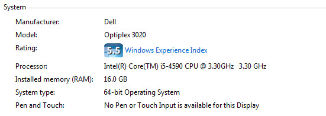
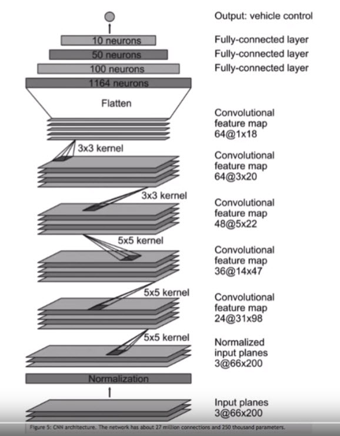
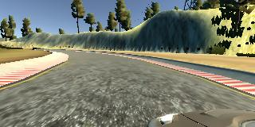
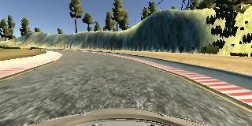
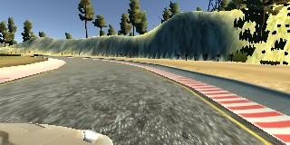
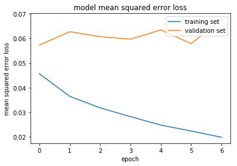

# BehavioralCloning

<h3> Using docker </h3>

For this project I used a docker as I was navigating between computers to look for more horsepower, docker made it wasy to switch computer to computer.

<pre>
docker pull udacity/carnd-term1-starter-kit
</pre>

<pre>
docker run -it --rm -p 8888:8888 -v `pwd`:/src udacity/carnd-term1-starter-kit
</pre>

<h3>Strategies for Collecting Data</h3>

Using the simulator on the first track I trained the car over 3 laps:
- 2 lapes driving forward
- 1 lap driving following the track in the opposite direction to learn more curbs
- stay in the middle of the road
- recover to the center when veering off the side:record several parts starting from the side of the side of the road and moving to center to learn how to avoid the sides

Image name 
<left><right> information is saved in the director 'data' as "driving_log.csv" and the images are saved in the IMG folder.

<h3> Programming </h3>

On using generator: I tried out the generator as memeory was a limiting factor on my PC but it was really too slow, especially when you have to follow a try and errors approach.

Using a simple form I was at the limit of the computer and it took around <b>14 minutes to process the 7 epochs</b>.

 

<li> Preprocessing </li>

The data are normalized and then cropped to give the focus on the road and above the windshield. This helps to get resutls fater.

<pre>
      
model.add(Lambda(lambda x: x/255.0 - 0.5, input_shape = (160, 320, 3)))
print("Lambda applied")

model.add(Cropping2D(cropping=((70,25),(0,0))))
print("Cropping applied")
</pre>

For reference Generator I tried:
<pre>
def generator(lines, batch_size=32):
    num_samples = len(lines)
    while 1: # Loop forever so the generator never terminates
        shuffle(lines)
        
        for offset in range(1, num_samples, batch_size): #starts at 1 to avoid headers
            batch_samples = lines[offset:offset+batch_size]

            images = []
            angles = []
            for batch_sample in batch_samples:
                source_path = line[0]
                filename = source_path.split('/')[-1]
                current_path =filename # 'data/IMG/'+ filename

                #print("current path", current_path)
                image = cv2.imread(current_path)
                images.append(image)
    
                # extracting the steering wheel as labels
                #print ("steering angle", line[3])
                #print ("angle measurement", measurement)
            
                measurement = float(batch_sample[3])
                angles.append(measurement)
                
                # checking array validity
                #print ("measurement in array", measurements[66])

                #Augment the number of images by getting a flip of each image
                augmented_images, augmented_angles = [], []
                for image, measurement in zip(images, angles):
                    augmented_images.append(image)
                    augmented_angles.append(measurement)
                    augmented_images.append(cv2.flip(image,1))
                    augmented_angles.append(-1*measurement)

            # trim image to only see section with road
            X_train = np.array(augmented_images)
            y_train = np.array(augmented_angles)
            yield sklearn.utils.shuffle(X_train, y_train)
            
            
# compile and train the model using the generator function
train_generator = generator(train_samples, batch_size=32)
validation_generator = generator(validation_samples, batch_size=32)            

</pre>

<h3> Architecture </h3>

The first architecture proposed in the lesson drove the car directly in the mountain.

For the project I relied on the Nvidia architecture that allowed the car to immediatly start taking turns, follow the road.
What made a big difference was to use additional images, either slipping the center image or adding the right left and right cameras.
This helped decreasing the error loss.

Final architecture: 

 
 Nvidia Architecture

It has a normalization layer, 5 convolutional layers and 4 fully connected layers.

<h3> visualizing the acquired data </h3>
Each sampling has a <b>center</b>, <b>left</b> and <b>right</b> image with the same reference: 

<left><right>_2017_12_31_17_54_56_108.jpg:   

<table style="width:100%">
  <tr>
    <th>LEFT</th>
    <th>CENTER</th> 
    <th>RIGHT</th>
  </tr>
  <tr>
    <td></td>
    <td> </td> 
    <td> </td>
  </tr>
 
</table>

<h3> Augmented the number of images </h3>

Two ways have been tried out:

<li> adding new images by flipping each image horizontally using the following code:
<pre>

"""
#Augment the number of images by getting a flip of each image
augmented_images, augmented_measurements = [], []
for image, measurement in zip(images, measurements):
    augmented_images.append(image)
    augmented_measurements.append(measurement)
    augmented_images.append(cv2.flip(image,1))
    augmented_measurements.append(-1*measurement)
"""
</pre>

<li> adding the image from the left and right cameras and associating angles to them </li>
<pre>
    image = cv2.imread(current_path)
    images.append(image)
    images.append(cv2.imread(line[1]))
    images.append(cv2.imread(line[2]))
    
</pre>

associating angles:
 <pre>
  # extracting the steering wheel as labels
    #print ("steering angle", line[3])
    measurement = float(line[3])
    
    #print ("measurement", measurement)
    measurements.append(measurement)
    measurements.append(measurement+0.275)
    measurements.append(measurement-0.275)
    
  </pre>  
    
<h3> Fine Tuning the Model </h3>
   
   <li>I chose epochs = 7.</li>
   <li>the angles: </li>   the angles created frtom the left and right camera the value that allowed the car to stay on the road was +/- 0.275
   With 0.27 the car was slightly driving over the side after the bridge
   
<h3> Error Loss </h3>

 The error loss shows that after 4 epochs the error is decreasing jsut a little.
 I chose 7 as my car was driving almost perfect but still I needed an extra precision

 EPOCH running on the computer:

<h3> Recording the video </h3>

The dependencies for video.py were missing in the docker, was resolved using :
<pre>
import imageio
imageio.plugins.ffmpeg.download()
</pre>
