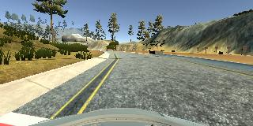
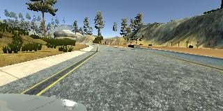

# BehavioralCloning

<h3>Strategies for Collecting Data</h3>

Using the simulator on the first track I trained the car over 3 laps:
-stay in the middle of the road
-decrease speed when approaching a curve
-recover to the center when veering off the side

data are saved in a separate folder 'data' under the form of a csv and IMG folder containing screen shots of the scene

<h3> visualizing the acquired data </h3>
Each sampling has a <b>center</b>, <b>left</b> and <b>right</b> image with the same reference: 

<left><right>_2017_12_31_17_54_56_108.jpg:   
 CENTER </img> 
 LEFT </img> 
 RIGHT </img> 

